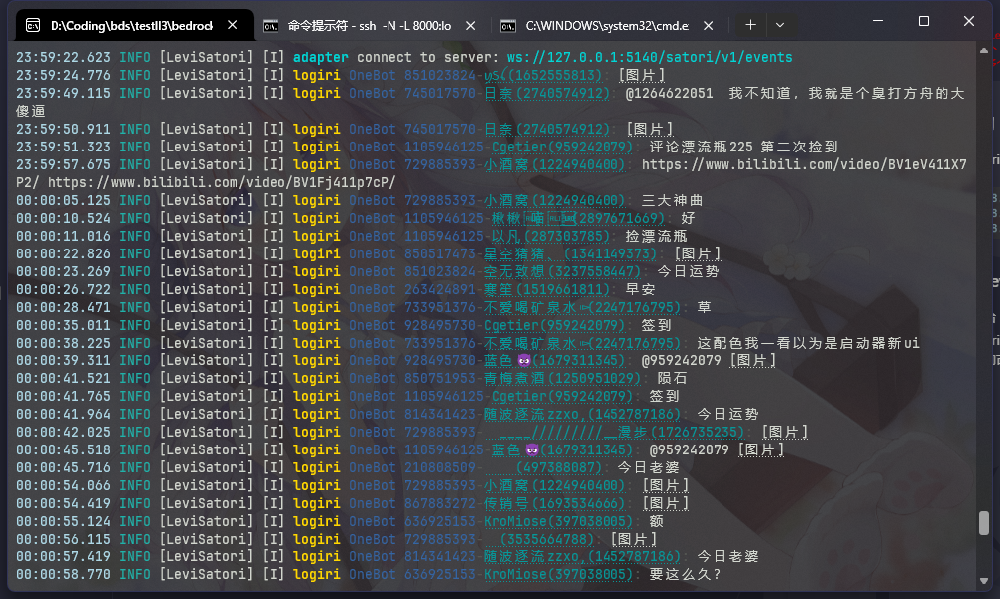
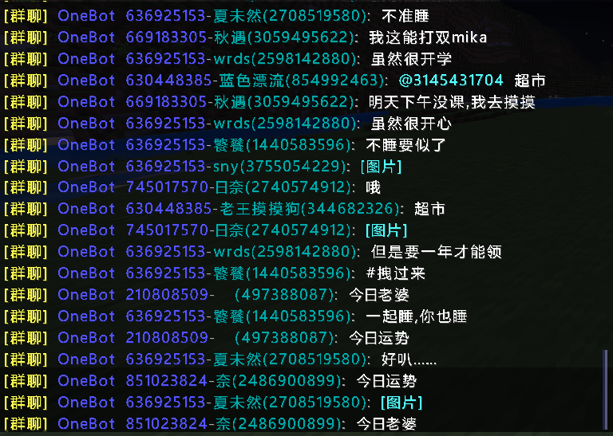

<!-- markdownlint-disable MD033 -->

# LeviLogiri

在控制台和游戏中打印 [LeviSatori](https://github.com/lgc-LLDev/LeviSatori) 收到的消息！

## 展示

  


## 安装

```bash
lip i github.com/lgc-LLDev/LeviLogiri
```

## 配置

注：此插件不可重用

关于 频道（Channel）与 群组（Guild）的概念请参见 [Koishi 文档](https://koishi.chat/zh-CN/guide/adapter/#%E6%A0%B8%E5%BF%83%E6%A6%82%E5%BF%B5)

```yml
plugins:
  # ...
  LeviLogiri:
    # 是否在控制台中打印消息
    enableInConsole: true

    # 是否在游戏中打印消息
    enableInGame: true

    # 要在游戏中打印消息的频道，可以省略代表打印所有频道
    gameEnabledChannels:
      # 可以使用 平台:ID 的形式指定
      - onebot:123456789
      # 也可以以对象的形式指定
      - platform: onebot # platform 可以省略，如省略则不判断平台
        id: '123456789'

    # 要在游戏中打印消息的群组，可以省略代表打印所有群组
    gameEnabledGuilds:
      # 同上
      - onebot:123456789
      - platform: onebot
        id: '123456789'
```

## 联系我

QQ：3076823485  
吹水群：[1105946125](https://jq.qq.com/?_wv=1027&k=Z3n1MpEp)  
邮箱：<lgc2333@126.com>

## 鸣谢

### [ilharp/logiri](https://github.com/ilharp/logiri)

实现参考

## 赞助

感谢大家的赞助！你们的赞助将是我继续创作的动力！

- [爱发电](https://afdian.net/@lgc2333)
- <details>
    <summary>赞助二维码（点击展开）</summary>

  

  </details>

## 更新日志

暂无
